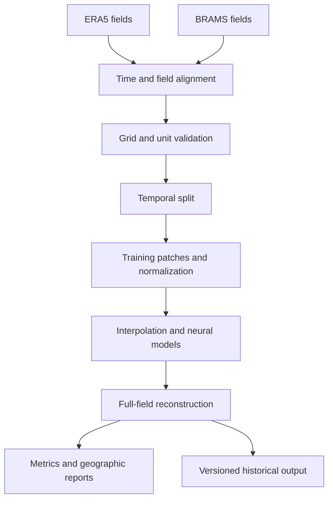

# Architecture and scope

Date: 2026-10-06
Status: accepted direction; temporal coverage and pairing policy pending validation.

## 1. Research question

Can a reproducible multivariate model reconstruct regional BRAMS simulation fields from ERA5 at matching valid times better than spatial interpolation, while preserving useful spatial structure and cross-variable consistency?

Users are scientific ML reviewers and researchers developing regional weather experiments. A later consumer is a weather forecaster using sequences of generated historical fields. This document does not redefine forecast-forge's existing forecasting-framework scope; a weather forecasting integration requires its own scope decision.

## 2. Domain and field contract

Use a proposed bounding box of north 1 N, south 19 S, west 49 W and east 33 W. Verify coverage of all nine Northeast states against a documented boundary source. Keep surrounding land and ocean as context, and report separate metrics over the state mask and full domain. Exact cell selection and boundary padding must be recorded.

Use the actual BRAMS latitude-longitude coordinates as the output grid. The archive's nominal 8 km label is not a constant physical spacing: longitudinal cell size varies with latitude.

| Initial output | BRAMS sample identifier | Contract |
| --- | --- | --- |
| Temperature at 2 m | 2t | Instantaneous, Kelvin |
| Dewpoint at 2 m | 2d | Instantaneous, Kelvin |
| Wind u at 10 m | 10u | Instantaneous eastward component, m/s |
| Wind v at 10 m | 10v | Instantaneous northward component, m/s |
| Mean sea-level pressure | prmsl | Instantaneous; verify unit and parameter metadata |

Confirm ERA5 counterparts, units, level definitions and coordinate conventions before pairing. Keep u and v as learned outputs; derive speed as sqrt(u^2 + v^2). Define meteorological wind-direction convention and mask calm-wind direction where appropriate. Temperature minima/maxima over an interval are not substitutes for instantaneous temperature.

Predictor channels can exceed output channels, but additions require availability and ablation evidence. Static elevation and land/sea information are candidates after the simplest baseline. No atmospheric level or precipitation variable enters by name alone: identify parameter, level, time statistic and accumulation boundaries.

## 3. Source evidence and pending choices

User inspection of `BRAMS_ams_08km_2026010100_2026010106.grib2` confirmed a regular_ll grid, Ni=978, Nj=1009, latitudes approximately -51.7434 to 15.6279 and longitudes 267.1327 to 340.8670. Initial temperature, dewpoint and wind fields are instantaneous at +6 hours, valid 2026-01-01 06 UTC. Temperature maxima/minima span +5 to +6 hours.

This is a single sample. It does not establish archive completeness, latency, consistency or optimal forecast lead. Audit multiple cycles and dates before freezing a BRAMS lead policy. Start with a fixed lead candidate such as +6 h, but choose and justify it after checking availability and spin-up behavior. Never silently mix different leads for the same valid time.

Choose the period only after verifying overlapping ERA5/BRAMS coverage. One year may limit seasonal and interannual generalization; document the actual limits rather than promising coverage.

## 4. Pipeline and responsibilities

| Module | Responsibility |
| --- | --- |
| data | Source discovery, download, manifests and GRIB/NetCDF reads |
| preprocessing | Time matching, units, coordinates, regridding and masks |
| datasets | Temporal partitions, normalization application and patches |
| models | Interpolation wrappers, U-Net and later residual/generative models |
| training | Reproducible training, checkpoints and validation |
| evaluation | Physical-unit metrics, uncertainty and spatial diagnostics |
| visualization | Geographic comparisons, errors and later spectra |

Authoritative code lives under src/cosmic_downscaler. Notebooks support exploration. No API or orchestration service is required by the first batch experiment.

## 5. Alignment and reproducibility

Record initialization time, forecast lead, valid time and download time independently. Pair ERA5 with BRAMS using valid time in UTC. Resolve duplicate valid times according to the frozen cycle/lead rule.

Normalize longitude convention, sort coordinates consistently, verify scan orientation and check land/sea boundaries. Any interpolation of ERA5 to the target grid must be explicit and identical for baseline and neural comparisons. Do not interpolate BRAMS onto a coarser grid and then claim retained native high-resolution targets.

Version source files by hashes, field selection, grid, domain, masks, units and pairing policy. Record source/model changes and missing dates. Build a manifest with one entry per paired timestamp and required variable set. Reject or explicitly flag incomplete pairs; no silent temporal interpolation across missing fields.

Processed formats may be NetCDF or chunked Zarr; choose after I/O measurements. Stream/select fields instead of keeping the continental archive in RAM. Record code revision, configuration, seeds and actual dependencies.

## 6. Model progression

1. Nearest-neighbor and bilinear interpolation for each compatible field.
2. Deterministic multichannel U-Net with documented predictor/output grid handling.
3. Residual learning relative to a declared interpolation or deterministic reference; compare whether it adds measurable value.
4. Lightweight conditional generative residual experiment, inspired by CorrDiff, only after deterministic evaluation and resource profiling.

Train with patches on the available 16 GB GPU and 64 GB RAM. Select patch size and batch size empirically. Maintain spatial alignment between coarse predictors and fine targets. If using upsampled inputs, record that architectural choice.

Fit per-channel normalization on training periods only. Use channel-scaled losses so Kelvin, Pa and m/s do not compete solely because of unit magnitude. State weights and validate cross-variable consistency, including dewpoint exceeding temperature and wind speed consistency. Do not hide violations using post-processing without reporting its effect.

## 7. Temporal evaluation

Split complete timestamps and their patches chronologically. Keep all overlapping patches, all variables and outputs from a common meteorological event within the same partition. Use temporal gaps chosen from window length and dependence diagnostics. A later forecaster additionally requires windows whose inputs and future targets do not cross split boundaries.

Choose model settings on validation and freeze final test periods. Report overall, seasonal and regional results with actual sample counts. Estimate uncertainty using temporal blocks rather than treating correlated pixels or adjacent hours as independent observations.

Evaluate reconstructed fields, not only individual patches. Use overlapping-patch blending and report edge/seam effects. RMSE, MAE and signed bias are reported in physical units, with area weighting and a documented state mask. Evaluate u/v and derived speed; direction needs circular treatment and a calm-wind rule.

Use maps of inputs, interpolation, BRAMS reference, predictions and errors. Later add spectra and distribution/extreme diagnostics with consistent masks and preprocessing. Generative models require ensemble calibration, spread and proper probabilistic scores in addition to point errors; low sample RMSE alone is insufficient.

Primary metrics and practical improvement criteria must be frozen before inspecting final test results. Independent station or other observation comparisons are a separate validation requirement for real-world accuracy claims, including representativeness and elevation differences.

## 8. Historical output interface

Export versioned fields with valid_time, latitude, longitude and explicit named variables/units. Retain input source, downscaler version, reference-grid version, lead policy, masks and quality flags. A stochastic extension also needs ensemble member and sampling metadata.

Future weather-model training may use sequences of these fields to predict 48-72 hours ahead. This is synthetic/model-derived training data and can propagate downscaler and BRAMS biases. Evaluate future predictions against held-out BRAMS and independent observations where available; agreement with the same generator alone is not evidence of weather skill.

For downstream validation/test periods, fit the downscaler without those periods. Use chronological fitting or cross-fitting for downstream development so generated outputs are not misleadingly evaluated on dates seen during downscaler training.

## 9. Operational extension

A first experiment is retrospective, using ERA5 histories. A future operational chain can consume available analysis or short-lead forecast fields from BRAMS, GFS or IFS. BRAMS already on the target grid may feed the forecaster directly; coarse operational fields may require an adapted downscaler.

Reproduce availability at each issuance time: only use cycles published before that time, and distinguish initialization, valid time and publication time. Assess distribution shift and source-specific errors using archived operational inputs. Do not assume an ERA5-trained mapping transfers unchanged.

Compare 48-72-hour forecasts with persistence and the operational source's own forecasts at the same valid times and using comparable available information. Baseline access and independent verification must be documented.

## 10. Completion criteria and open decisions

Documentation is complete when scope, contracts and pending choices are explicit. Data foundations require source terms, ERA5 access, verified regional coverage, overlap period, field matches, BRAMS lead/cycle policy and temporal partitions.

The first baseline release requires reproducible paired data, meaningful tests of alignment and patch reconstruction, interpolation reports in physical units and geographic comparisons. The deterministic release adds reproducible training, held-out improvement analysis and limitations. Generative and operational extensions require separate evidence and are not prerequisites for a useful first release.

## References

- [CPTEC/INPE BRAMS archive](https://dataserver.cptec.inpe.br/dataserver_modelos/brams/ams_08km/brutos/2026/)
- [Inspected sample descriptor](https://dataserver.cptec.inpe.br/dataserver_modelos/brams/ams_08km/brutos/2026/01/01/00/BRAMS_ams_08km_2026010100_2026010106.ctl)
- [ECMWF open operational data](https://www.ecmwf.int/en/forecasts/datasets/open-data)

Record exact dataset documentation and selected release/version during ingestion. These links do not substitute for verification of download rights or variable contracts.